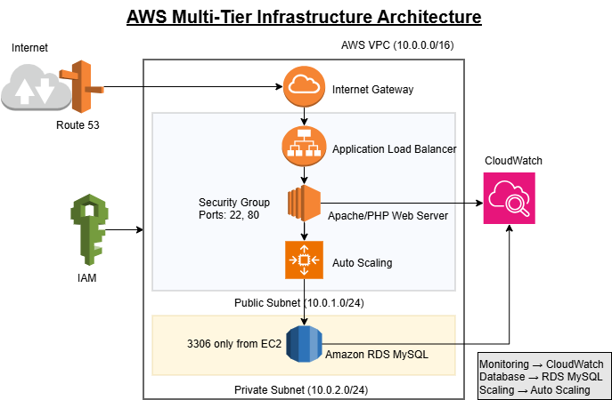
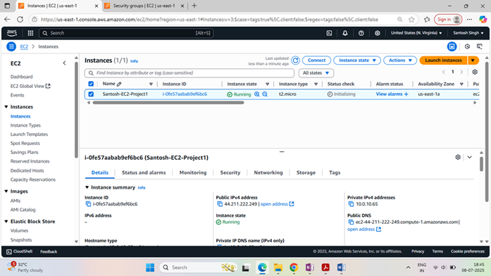
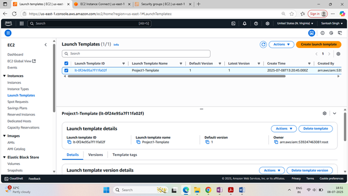
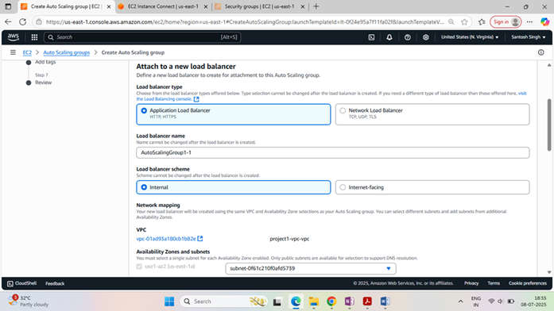
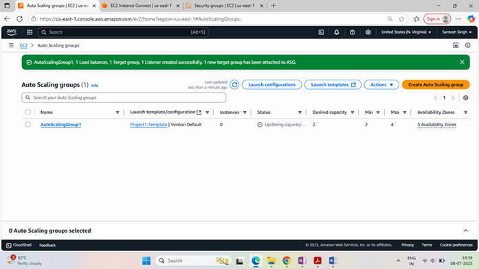
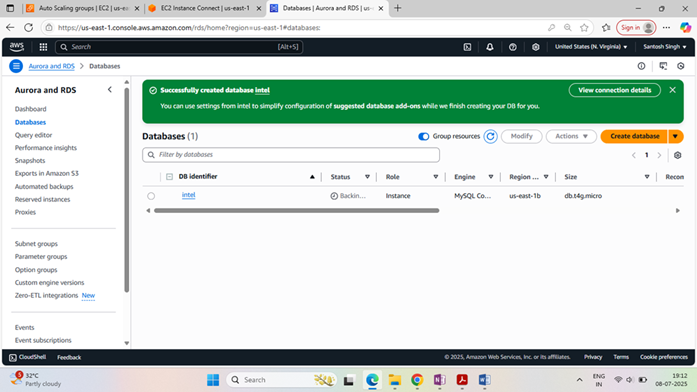
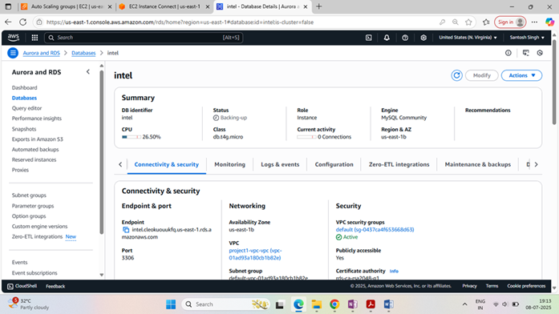
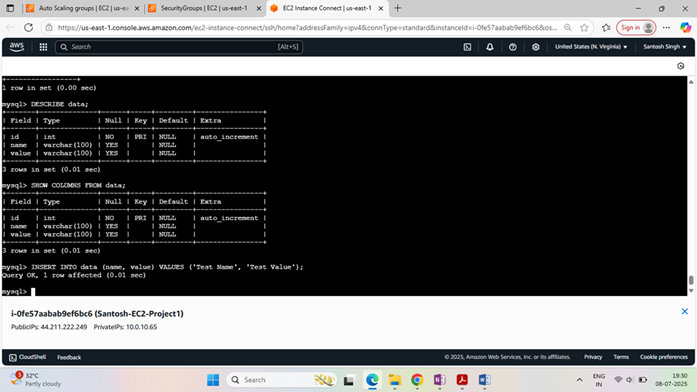

# AWS Multi-Tier Infrastructure Automation

## Overview

Enterprise-grade AWS infrastructure automation project using Terraform, VPC, EC2, RDS, IAM, Route 53, and CloudWatch.

This project demonstrates Infrastructure-as-Code (IaC), secure network architecture, cloud automation, and operational monitoring for scalable AWS environments.

---

## Architecture Diagram



---

# Technologies Used

- AWS EC2
- AWS RDS
- VPC
- Route 53
- IAM
- Security Groups
- CloudWatch
- Terraform
- Bash Scripting

---

# Features

- Multi-tier AWS architecture
- Infrastructure as Code using Terraform
- Secure VPC and subnet design
- Automated EC2 provisioning
- CloudWatch monitoring setup
- IAM-based access control
- Operational automation

---

# Project Structure

```text
aws-multi-tier-infrastructure/
│
├── architecture/
├── terraform/
├── monitoring/
├── scripts/
├── screenshots/
└── README.md
```

---

# Deployment Steps

## Initialize Terraform

```bash
terraform init
```

## Validate Configuration

```bash
terraform validate
```

## Deploy Infrastructure

```bash
terraform apply
```

---

# Security Best Practices

- IAM-based access controls
- Network isolation using VPC
- Security Group restrictions
- Principle of least privilege
- Infrastructure automation

---

# Future Enhancements

- Auto Scaling
- Load Balancer
- Kubernetes Integration
- CI/CD Automation
- Monitoring Dashboards
- Multi-region deployment

---

# 📸 Project Screenshots

## Architecture Diagram


---

## EC2 Instance Running



---

## Launch Template



---

## Application Load Balancer



---

## Auto Scaling Group



---

## RDS MySQL Instance



---

## MySQL Connectivity



---

## Database Validation



# 🚀 Deployment Steps

```bash
terraform init
terraform validate
terraform plan
terraform apply
```

---

# 🧹 Cleanup

```bash
terraform destroy
```

---

# Author

Santosh Singh  
Cloud & DevOps Engineer
